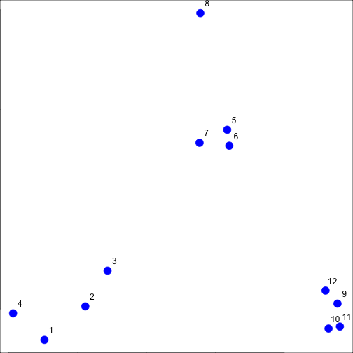
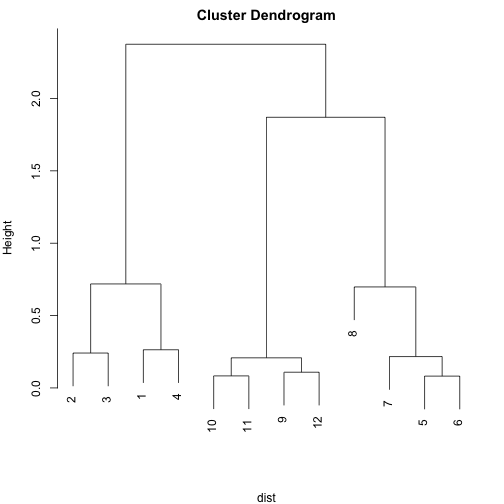
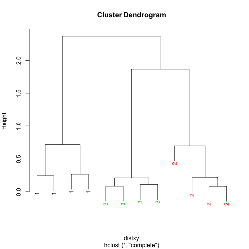
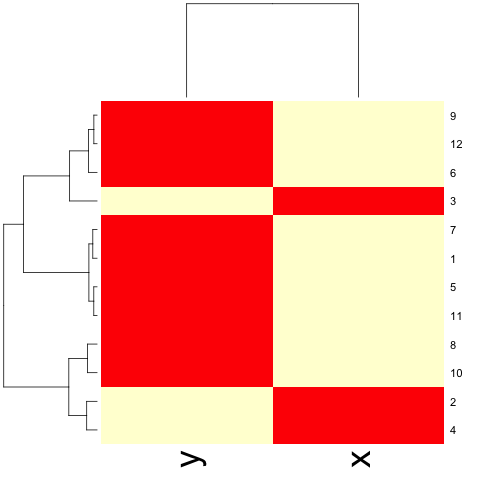

Hierarchical clustering
========================================================

Se emplea en datos multidimensionales


En primer lugar es importante definir una metrica (como se que dos puntos estan cerca)
 
 
 La idea es tener al final un arbol de relacciones 
 
 Es tambien necesario tener un merging aproach


Eleccion de la metrica:

Euclidea

Continua (emplear la correlaccion entre dos puntos como distancia)

Binary  : distancia Manhattan  sum(i)abs(x_i-y_i) 


Vamos a jugar con un ejemplo


```r
set.seed(1234)
par(mar = c(0, 0, 0, 0))
x <- rnorm(12, mean = rep(1:3, each = 4), sd = 0.2)
y <- rnorm(12, mean = rep(c(1, 2, 1), each = 4), sd = 0.2)
plot(x, y, col = "blue", pch = 19, cex = 2)
text(x + 0.05, y + 0.05, labels = as.character(1:12))
```

 

 
 
 
Empezamos a usar el comando dist, que permite calcular las distancias euclidas, max manhatam, canberra binary y minkowsky 


```r
dataFrame <- data.frame(x = x, y = y)
dist <- dist(dataFrame)
```


la idea es que los dos puntos mas cercanos se convierten en un cluster, a este se le asigna la posicion central de ellos y se itera, hasta tener una estructura de arbol


```r
clusters <- hclust(dist)
par(mar = c(4, 4, 2, 2))
plot(clusters)
```

 


La cosa es saber donde cortar el arbol 


Una version mas bonita


```r
myplclust <- function(hclust, lab = hclust$labels, lab.col = rep(1, length(hclust$labels)), 
    hang = 0.1, ...) {
    ## modifiction of plclust for plotting hclust objects *in colour*! Copyright
    ## Eva KF Chan 2009 Arguments: hclust: hclust object lab: a character vector
    ## of labels of the leaves of the tree lab.col: colour for the labels;
    ## NA=default device foreground colour hang: as in hclust & plclust Side
    ## effect: A display of hierarchical cluster with coloured leaf labels.
    y <- rep(hclust$height, 2)
    x <- as.numeric(hclust$merge)
    y <- y[which(x < 0)]
    x <- x[which(x < 0)]
    x <- abs(x)
    y <- y[order(x)]
    x <- x[order(x)]
    plot(hclust, labels = FALSE, hang = hang, ...)
    text(x = x, y = y[hclust$order] - (max(hclust$height) * hang), labels = lab[hclust$order], 
        col = lab.col[hclust$order], srt = 90, adj = c(1, 0.5), xpd = NA, ...)
}
```


```r
dataFrame <- data.frame(x = x, y = y)
distxy <- dist(dataFrame)
hClustering <- hclust(distxy)
myplclust(hClustering, lab = rep(1:3, each = 4), lab.col = rep(1:3, each = 4))
```

 

 
 
 
Merging points together 

average:  el centro de gravedad 

complete:  tomar la distancia entre los dos puntos mas alejados del cluster 


heatmap
------------

hace un hierchal por filas y por columnas y hace los bloques que puede 


```r
dataFrame <- data.frame(x = x, y = y)
set.seed(143)
dataMatrix <- as.matrix(dataFrame)[sample(1:12), ]
heatmap(dataMatrix)
```

 

