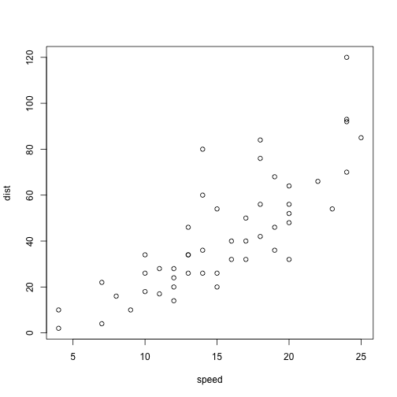
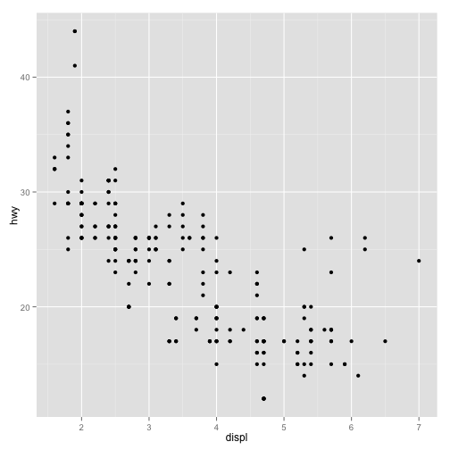

Apuntes semana 1
========================================================

Principios basicos 
--------------------


Show comparison,  hay que comparar lo que se tiene con algo (controles ...)

Show causality, mechanismo...  Habria que dar una muestra de la causa que creemos de los resultados (Pej, como ha cambiado el entorno al poner un limpiador de aire, no solo como han cambiado los sintomas) 

Show multivariate data  (no siempre estamos en flatland)  (se pueden emplear splits, los tableros que tanto me gustaban en la tesis) 

Integracion de la evidencia,  usar varios tipos de grafica...

Emplear las etiquetas, unidades... apropiadas  (y las fuentes!!!!)

El contenido es lo fundamental 


Exploratory Graphs
------------------

En general se hacen rapido y muchos para irse haciendo una idea, pasando en principio de dejar labels y esas cosas y ya se podnran en lso que se usen 


### Simple summaries of data

#### Five numbers summary

No es un grafico, es summary(), que da media y quantiles

#### boxplot

usas boxplot()


#### histogram

usa histogram()  (si se fija uno, abajo estan todos los puntos) 
opcion fundamental es breaks=numero  para poner el numero de barritas 


#### para usar con todos 

abline(h=)  pone una linea horizontal
abline(v=) pone una linea vertical  (y la gracia es que se puede poner en la mediana...) 


####  barplot 

Grafico de barras al mas puro estilo excell 


### Vamos con dos variables

#### Mutiple / overlayed 1d plot
esto con ggplot o lattice, mas adelante


#### Multiple boxplots

boxplot(var1~var2, data=misdatos) (se rompe por var2 ) 

#### Multiple histograms  

se parte el grafico con par y se meten uno a continuacion del otro  ver la documentacion de par  (y usar subset para hacer los gripos)

par(mfrow=c(1,2),mar=c(5,4,2,1))

#### scatterplot 

se usa plot,  para no escribir mucho mola la construciion with(data,plot(var1,var2))

es muy habitual usar color para poner los subgrupos con col=var3


Plotting systems in R
-----------------------

### Base

Empiezas con un lienzo en blanco y vas rellenando 

se empieza con un plot (o alguna de sus coberturas) y despues se van agnadiendo cosas con funciones de anotacion (text, lines, points, axes)


se puede usar type="n"" para que no ponga puntos e ir a??adiendolos con points 


```r
library(datasets)
data(cars)
with(cars, plot(speed, dist))
```

 


### lattice

Paquete aparte 

Se hace todo con un unico comando( y cienes de opciones)

Muy util para hacer pannels cambiando una o dos variables

No se pueden a??adir cosas, y es bastante complicado de usar las anotaciones


```r
library(lattice)
state <- data.frame(state.x77, region = state.region)
xyplot(Life.Exp ~ Income | region, data = state, layout = c(4, 1))
```

 

```r

```


### ggplot2 

Es una aproximacion semantica, es parecido al principio de lattice, pero permite a??adir cosas a posteriori


```r
library(ggplot2)
data(mpg)
qplot(displ, hwy, data = mpg)
```

 


------------------------------


Basic Plotting System
-----------------------------------

esta metido en los dos paquetes

graphics y grDevices 

En primer lugar se inicializa (con plot, o hist) y despues se anota o boxplot

los parametros se pueden ver en ?par

importantes

pch  plotting character

lty  tipo de linea
lwd  grosor de linea (debe ser un entero)

col   color  puede ser util la funcion colors para pasar de nombre a valor de colores 

xlab, ylab  son los nombres de los ejes 


en la funcion par,  parametros globales para todos los graficos 

las:  orientacion de los labels

bg:  color del fondo

mar: margen 

oma:  outer margin 

mfrow y mfcol  numero de columnas y filas de graficas (y si se llena en orde de col o de filas), el argumento son dos numeros

par("nombre") da el valor por defecto


Funciones usadas

plot  pues eso

lines:  a??adir lineas a un plot, solo conectan los puntos

points: a??adir puntos

text: a??adir leyendas 

tittle: a??adir leyendas en zonas fijas,  ejes...

mtext:  texto en los margenes


axis:  toquetear los ticks y esas cosas

se pueden a??adir puntos con points para cambiar los colores, con col= 

legend, puedes poner los simbolos y a??adir nombres 

linea de regresion: 

se puede hacer con un model<- lm(var1~var2,data)  y despues abline(model,opciones)

Si hay varios plots,  mtext es el texto del conjunto, y el de cada objeto se pone con una opcion main="" en cada plot


Graphic devices
-----------------

mac  quartz()
windows  windows()
linux  x11()


los disponibles se ven en ?Devices

### file devices

Si se quiere hacer a un archivo se lanza el device,  vgr pdf(file="")  despues se hace todo lo que se tenia hecho para la pantalla y despues se cierra con dev.off() para que se salve


#### vector:

pdf, svg, postcript,  y win.metafile

#### bitmap 

png, jpeg, tiff, bmp


se pueden tener abiertos varios,  se ve cual es el que esta en uso con dev.cur y se elige cual es con dev.set


dev.copy  copia a otro dev dev.copy(png,file="pepito")

dev.copy2pdf 

Ojo, acordarse de cerrar el dev


lattice
----------------------

en lattice y grid

