Apuntes semana 2
========================================================

Lattice plotting system
------------------------

Multidim data y para hacer muchos de golpe (esto habria venido de la leche en mi tesis)

Esta repartido entre los paquetes lattice y grid (aunque a este se le suele llamar de forma interna) 

Se hace todo con una sola llamada a la funcion, aunque puede ser una llamada larga de narices

Funciones dentro de el

### xyplot 

en general se llama de la forma

xplot( x~y | f * g, data )

f, g conditioning variables * es la interaccion

si no se especifica data se busca en el parent


```r
library(lattice)
library(datasets)

xyplot(Ozone ~ Wind, data = airquality)
```

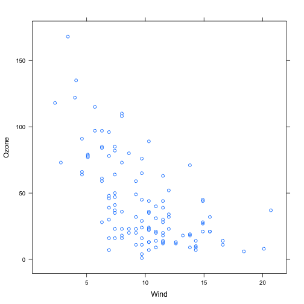 


las condition variables deberian ser factores 


```r
library(lattice)
library(datasets)

airquality <- transform(airquality, Month = factor(Month))

xyplot(Ozone ~ Wind | Month, data = airquality, layout = c(5, 1))
```

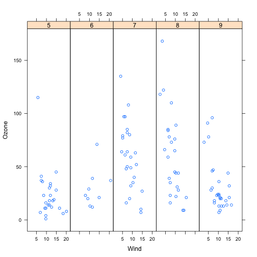 


###  bwplot

### histogram

###  stripplot (como un boxplot pero con puntos)

###  splom 

###  levelplot, contourplot 


Comportamiento de Lattice
-------------------------

Lo que devuelven las llamadas es un objeto de clase trellis, que es autoimprimible


```r
library(lattice)
library(datasets)

p <- xyplot(Ozone ~ Wind, data = airquality)
# Aqui no ha pasado nada

print(p)
```

 

 
 
Lattice panel functions
-----------------------

Sirven para controlar lo que pasa en cada cuadradito
viene con las suyas por defecto pero se pueden tunear

Reciben las coordenadas X/y de cada panel (y ...) 


Primer ejemplo (sin customizar)


```r
set.seed(10)
x <- rnorm(100)
f <- rep(0:1, each = 50)
y <- x + f - f * x + rnorm(100, sd = 0.5)
f <- factor(f, labels = c("Group 1", "Group 2"))
xyplot(y ~ x | f, layout = c(2, 1))  ## Plot with 2 panels
```

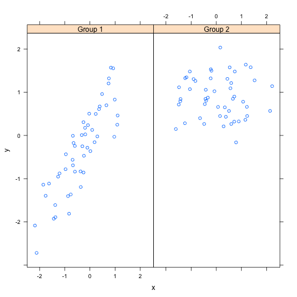 


Si customizamos se haria tal que asi


```r
## Custom panel function
xyplot(y ~ x | f, panel = function(x, y, ...) {
    panel.xyplot(x, y, ...)  ## First call the default panel function for 'xyplot'
    panel.abline(h = median(y), lty = 2)  ## Add a horizontal line at the median
})
```

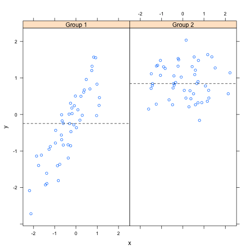 


las opciones se pueden sacar con un panel. y ver que autocompleta


```r
## Custom panel function
xyplot(y ~ x | f, panel = function(x, y, ...) {
    panel.xyplot(x, y, ...)  ## First call default panel function
    panel.lmline(x, y, col = 2)  ## Overlay a simple linear regression line
})
```

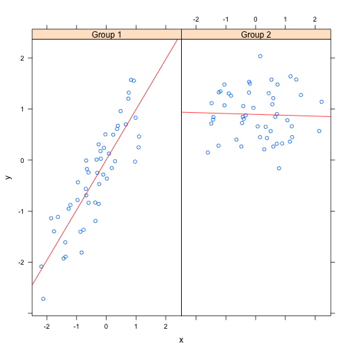 


-------------------------------
 
 
ggplot2
=============

Implementacion de "the gramar of graphycs"

documentacion en ggplot2
 
 
### qplot  

quick plot,  es la funcion basica y hace muchos tipos de plot 

Los datos tienen que estar en dataframe

se subsetea por datos que este como factores


### ggplot 

es la funcion fundamental y es la que mas puede hacer


```r
library(ggplot2)
data(mpg)

qplot(displ, hwy, data = mpg)
```

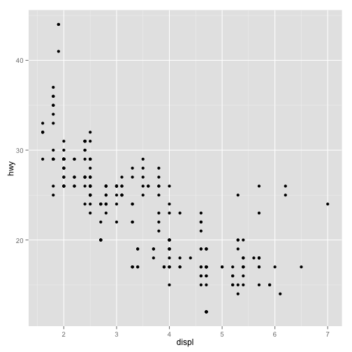 


Esto es autoexplicativo 

Si agnadimos color con un factor se pone sola la leyenda


```r

qplot(displ, hwy, data = mpg, col = drv)
```

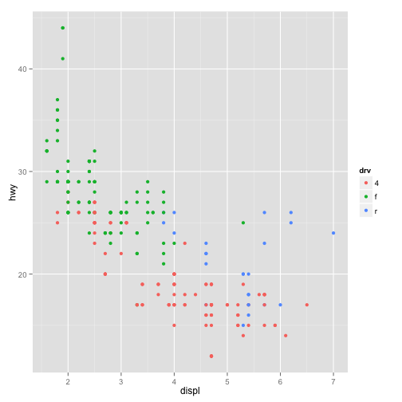 


Tambien se puede a??adir un summary con geom, por ejemplo desviaciones 


Si no se pusiera el point solo apareceria la linea


```r

qplot(displ, hwy, data = mpg, geom = c("point", "smooth"))
```

```
## geom_smooth: method="auto" and size of largest group is <1000, so using loess. Use 'method = x' to change the smoothing method.
```

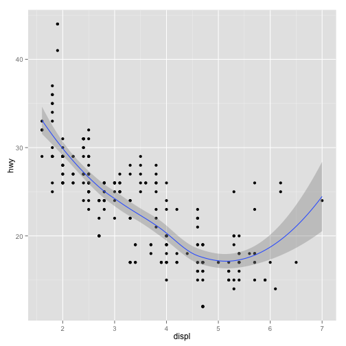 


con una sola variable hace solo un histograma


```r
qplot(hwy, data = mpg, fill = drv)
```

```
## stat_bin: binwidth defaulted to range/30. Use 'binwidth = x' to adjust this.
```

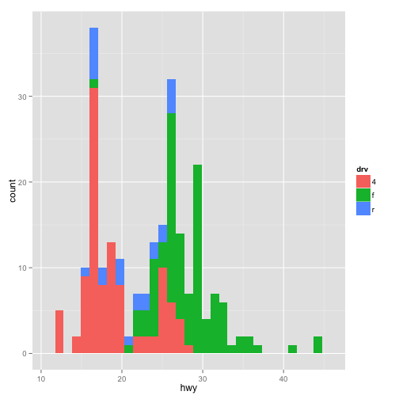 


### facets 

es el equivalente a los panels 


```r
qplot(displ, hwy, data = mpg, facets = . ~ drv)
```

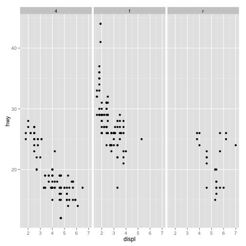 


importante como se ponen las interacciones en los facets 


```r
qplot(displ, hwy, data = mpg, facets = drv ~ ., binwidht = 2)
```

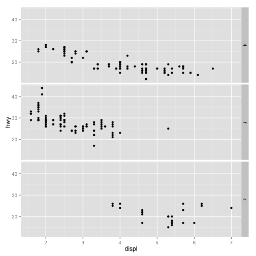 


si en vez de . se pusiera otra variable se pondria la interaccion  

con histogramas lo siguente mola 


```r
qplot(displ, data = mpg, facets = drv ~ .)
```

```
## stat_bin: binwidth defaulted to range/30. Use 'binwidth = x' to adjust this.
## stat_bin: binwidth defaulted to range/30. Use 'binwidth = x' to adjust this.
## stat_bin: binwidth defaulted to range/30. Use 'binwidth = x' to adjust this.
```

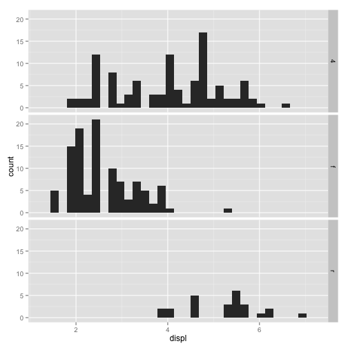 


con shape=variable se separa por variables como cuando se hace con colores 

al hacer un smooth  se pueden poner otros metodos (por ejemplo con method="lm") se hace un linear model 


ggplot generico
--------------

Funciona en layers

* Plot data
* Overlay a summary
* Metadata y anotaciones
